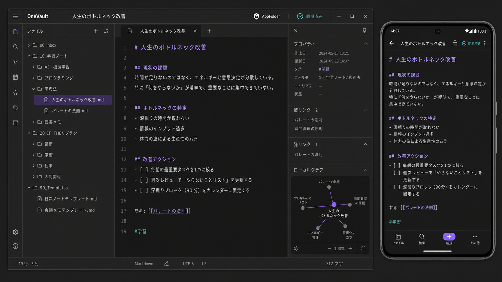

# OneVault v2

OneDrive AppFolder上のMarkdown Vaultを、PCとAndroidで安全に編集するインストール可能なPWAです。Markdownを正本にし、Obsidianとの往復互換を維持します。



## 主な機能

- PCのファイルツリー・Markdownエディタ・詳細パネルによる3ペイン表示
- Androidの全画面編集、下部ナビ、ファイル／詳細シート
- Markdownソース編集、閲覧モード、Wikiリンク、タグ、Properties、被リンク・発リンク
- OneDrive `Files.ReadWrite.AppFolder`による最小権限アクセス
- PBKDF2-HMAC-SHA-256とAES-256-GCMによる端末キャッシュ暗号化
- オフライン保存、Outbox、eTag競合保護、cTagベースの同期
- PWAインストールとGitHub Pages配信

## ローカル起動

```powershell
npm install
Copy-Item .env.example .env.local
npm run dev
```

Microsoft認証を設定していない場合はデモVaultが表示されます。明示的にデモを開く場合は`?demo=1`を付けます。

## Microsoft Entra設定

1. Microsoft Entra管理センターで新しいアプリ`OneVault`を登録します。
2. 対応アカウントを「個人用Microsoftアカウントのみ」にします。
3. プラットフォーム「Single-page application」に以下を登録します。
   - `http://localhost:5173/`
   - `https://<GitHubユーザー名>.github.io/onevault/`
4. Microsoft Graphの委任権限`Files.ReadWrite.AppFolder`だけを追加します。
5. アプリケーション（クライアント）IDを`.env.local`へ設定します。

```dotenv
VITE_MS_CLIENT_ID=xxxxxxxx-xxxx-xxxx-xxxx-xxxxxxxxxxxx
VITE_VAULT_FOLDER=KnowledgeVault
```

client IDはブラウザSPAでは公開情報です。client secretは作成・使用しません。

## Vault移行

最初のログインで`/me/drive/special/approot`を取得し、AppFolder内へ`KnowledgeVault`を作成します。現在のVaultは削除せず、OneDriveデスクトップ同期後に次へコピーします。

```text
コピー元: OneDrive\Notes\KnowledgeVault
コピー先: OneDrive\Apps\OneVault\KnowledgeVault
```

新旧ファイルの個数とSHA-256を照合し、OneVaultとObsidianの両方で確認してからObsidianの接続先を変更します。旧Vaultはバックアップとして保持してください。

安全なコピーと照合には同梱のスクリプトを使えます。これはコピー元を削除しません。

```powershell
.\scripts\migrate-vault.ps1 `
  -Source "$HOME\OneDrive\Notes\KnowledgeVault" `
  -Destination "$HOME\OneDrive\Apps\OneVault\KnowledgeVault"
```

## セキュリティ

- ノート本文はブラウザとMicrosoft Graph間で直接通信し、GitHubへ送信しません。
- 外部分析、広告、外部フォント、CDNスクリプトを使用しません。
- IndexedDBの本文、パス、検索情報、同期キューはPINから導出した鍵で暗号化します。
- PINを忘れた場合は端末キャッシュを消去し、OneDriveから復元します。
- AppFolder権限の実動作を確認できない場合、広い`Files.ReadWrite`へ自動フォールバックしません。

## 検証

```powershell
npm run typecheck
npm run lint
npm test
npm run build
```

## 旧版

Vanilla HTML/CSS/JSとローカルNodeサーバー版は`legacy/vanilla`に保存しています。
